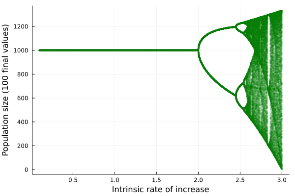

## Drawing a bifurcation diagram for logistic map

```julia
using Plots
```

```julia
Rs=collect(0.1:0.001:3) # a vector of r values
T = 5000
K = 1e3
N=zeros(length(Rs), T)

N[:,1] .= 1  # Set t0 values to 1

for (row, r) in enumerate(Rs), t in 2:T
    N[row, t] = N[row, t-1] + N[row, t-1] * r * ((K - N[row, t-1])/K)
end

w=100
all_Rs=repeat(Rs, inner = w)
all_Ns_array=[N[s, (T-(w-1)):T] for s in 1:size(N)[1]]

all_Ns=vcat(all_Ns_array...)

scatter(all_Rs, all_Ns,
    markercolor=:green,
    markerstrokecolor=:white,
    markersize=2,
    markerstrokewidth=0,legend=false,
    markeralpha = 0.1,
    xlabel = "Intrinsic rate of increase",
    ylabel = "Population size (100 final values)")
```



## Another version

```julia
rs = LinRange(0.1, 3.0, 2901)
K = 1e3
T = 5000
N = zeros(Float64, (T, length(rs)))

logmod(n, r, K) = n + n * r * (K-n)/K

for (j,r) in enumerate(rs)
    N[1,j] = 0.1
    for t in 2:T
        N[t,j] = logmod(N[t-1,j], r, K)
    end
end

F = N[end-99:end,:]
R = repeat(rs, inner=100)
points = unique(hcat(R, vec(F)); dims=1)
points[points[:,1] .> 2.9981, :]
nothing
```
