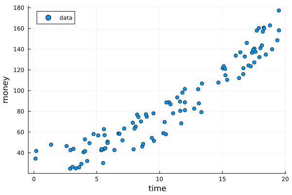
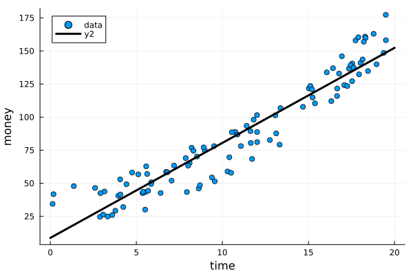
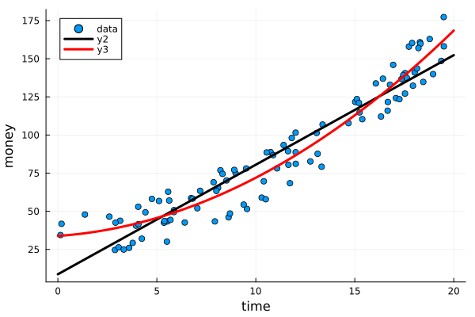

## Linear system of equations

For linear system of equations $\mathbf{A}\mathbf{x}=\mathbf{b}$, there three cases:

- $\mathbf{A}$ is a square matrix
- $\mathbf{A}$ is overdetermined if $m>n$ for an $m\times n$ matrix
- $\mathbf{A}$ is underdetermined if $m<n$

## Gaussian elimination

Pivot: the largest element of a column of a matrix.

- without pivoting
- with partial pivoting

Partial pivoting means row interchanges, and full pivoting means both row and column interchanges.

## Applications based on solutions of linear systems

### Polynormial interpolation (square)

**Vandermonde matrix**

The degree is n. It's easy to overfitted.

### Least-square solutions (overdetermined)

When we're confronted with **large amounts of data**, we often look for a **simple
quantitative model** that describes basic trends in the data.


```julia
using Plots, LinearAlgebra

n = 100
t = 20 * rand(n)
m = 300 ./ (1 .+ exp.(-(t .- 20)/6.5)) + 35 * rand(n)

plot(t, m, seriestype = :scatter, label = "data")
xlabel!("time")
ylabel!("money")
```


### Linear regression
Set the degree to 1, the equations become $p(x)=C+Dt$ or in matrix expression: $Ax=m$, `A` is $n\times 2$ matrix.

```julia
A = [ones(n) t]
rank(A), rank([A m])
```

````
(2, 3)
````
We choose $x$ to make $Ax-b$ as small as possible! This special value $x=x_*$ is called the
least-squares solution. 

```julia
M = A' * A
```

````
2×2 Matrix{Float64}:
  100.0    1084.61
 1084.61  14752.6
````

```julia
b = A' * m
xstar = M \ b
```

````
2-element Vector{Float64}:
 8.715219696815623
 7.181414777955385
````

```julia
tt = 20 * collect(0:250) / 250
mm = xstar[1] .+ xstar[2] * tt
plot!(tt, mm, lc = :black, lw = 3)
```


## Quadratic regression
Try to capture the upward curve by adding a quadratic term to our linear model. $p(x)=C+Dt+Et^2$
or in matrix expression: $Ax=m$, $A$ is $n\times 3$ matrix.

```julia
A = [ones(n) t t.^2]
M = A' * A
b = A' * m
xstar = M \ b
mm = xstar[1] .+ xstar[2]*tt + xstar[3]*tt.^2
plot!(tt, mm, lc = :red, lw = 3)
```



## Eigenvalue power method

## Concept

* Hermitian Matrix $A^H=A$
* Idempotent Matrix $A^2=A$
* Nilpotent Matrix $A^2=O$
* Unipotent Matrix $A^2=I$
* Tripotent Matrix $A^3=A$
* Involutory Matrix $A^2=I$
* $\langle A,B\rangle=A^{H}B$
* $exp(A)=\sum_{k=0}^{\infty}\frac{1}{k!}A^k$
* $log(I_n-A)=-\sum_{k=0}^{\infty}\frac{1}{k!}A^k$
* Direct sum $V=A\oplus B$ if

$$
  \begin{align}
   V=A+B\\
   A\cap B=\{0\}
   \end{align}
$$

* Hadamard product $A\odot B=[A_{ij}B_{ij}]$
* Kronecher (direct, tensor) product $A\otimes B=[a_{ij}B]$
* Vandermonde Matrix
* Fourier Matrix
* Hankel Matrix
* Hadamard Matrix
* Toeplitz Matrix

## Quadratic form and symmetric positive definite matrix

For a $n \times n$ matrix $\mathbf{A}$, a **quadratic form** can be expressed as

$$
\mathbf{x}^{T}\mathbf{A}\mathbf{x}=\sum_{i=1}^n\sum_{j=1}^n A_{ij}x_i x_j
$$

$\mathbf{A}$ is called a **symmetric positive definite matrix** (or SPD matrix) if it is
symmetric and for all nonzero $\mathbf{x}\in\mathbb{R}^n$

$$
\mathbf{x}^T \mathbf{A}\mathbf{x}>0
$$

## Factorization 

### LU factorization

Given $n\times n$ matrix $\mathbf{A}$, its **LU factorization** is $\mathbf{A}=\mathbf{L}\mathbf{U}$,
where $\mathbf{L}$ is a unit lower triangular matrix and $\mathbf{U}$ is an upper trianular matrix.

Row-Pivoted LU (PLU) factorization

> [!NOTE] "Row pivoting"
>
> When performing elimination in column j, choose as the pivot the element in column j
> that is largest in absolute value.
> 
> The row-pivoted LU factorization runs to completion if and only if the original matrix
> is invertible.

Three important types of matrices that cause the LU factorization to be specialized in some important way.

- Banded matrices
- Symmetric matrices

Used in linear systems.

### Cholesky

$\mathbf{A}=\mathbf{R}^T\mathbf{R}$ if $=\mathbf{A}$ is a SPD.

### QR factorization

A **Householder reflector** is a matrix of the form $\mathbf{P}=\mathbf{I}-2\mathbf{v}\mathbf{v}^T$.

### Bunch-Kaufman

## Norm

* Schatten p-norm

## Projector

* Orthogonal Projector
* Oblique Projector

## Linear Map vs  Matrix

A linear map is far more general than a matrix. Any linear map T over a vector
space V over a field F, just needs to satisfy two properties: For  v,w∈V  and
c∈F , then  T(v+w)=T(v)+T(w) and  T(cv)=cT(v) .

Notice that these properties are satisfied by matrices. However, to actually
construct a matrix, one needs more than a map. One also needs a basis. Without
a basis, there is no matrix! This is why multiple matrices can represent the
same linear map (albeit in different bases!). The problem of creating a "nice"
matrix to compute with forms the central motivation for the theory of
eigenvectors and eigenvalues.

Moreover, matrices are sometimes more powerful than general linear maps,
because there is a whole well developed theory of how to compute with them.
Computationally speaking, matrices are fantastically useful! However, once
again, we can only have a matrix given a map AND a basis.

In linear map your vector space  V  does not have to be a subset of ``R^n``;
instead, it can be an abstract vector space of functions, where you may or may
not be able to specify a finite number of basis functions for the space. In
particular, if you're dealing with an infinite dimensional vector space, then
you cannot use a matrix to represent that space precisely because there are not
a finite number of basis vectors.

## Translation

Translation is NOT linear transform!

$$
\left[\begin{array}{c}x' \\ y' \end{array}\right] =
\left[\begin{array}{cc}a & b \\ c & d \end{array}\right]
\left[\begin{array}{c}x \\ y \end{array}\right] +
\left[\begin{array}{c}t_x \\ t_y \end{array}\right]
$$

